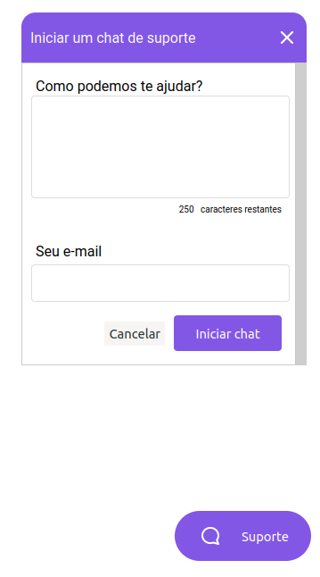

<p align="center">
   
   <a href="https://github.com/tgmarinho/README-ecoleta/stargazers"></p>

<h1 align="center">
CHATTYBOT
</h1>

<p align="center">
 <a href="#-sobre-o-projeto">Sobre</a> •
 <a href="#-layout">Layout</a> • 
 <a href="#-como-executar-o-projeto">Como executar</a> • 
 <a href="#-tecnologias">Tecnologias</a> • 
 <a href="#-autor">Autor</a> • 
 <a href="#user-content--licença">Licença</a>
</p>


## 💻 Sobre o projeto

O ChattyBot - É um bot que conecta o usúario e o administrador do sistema através de um simples chat de conversação para tirar as duvidas necessárias do usúario.

Projeto desenvolvido durante a **NLW - Next Level Week** oferecida pela [Rocketseat](https://blog.rocketseat.com.br/primeira-next-level-week/).


---

## 🎨 Layout

### Web

<p align="center" style="display: flex; align-items: flex-start; justify-content: center;">
  
</p>

---

## 🚀 Como executar o projeto

Este projeto é divido em duas partes:
1. Backend (pasta src) 
2. Frontend (pasta public)

💡O Frontend precisa que o Backend esteja sendo executado para funcionar.

### Pré-requisitos

Antes de começar, você vai precisar ter instalado em sua máquina as seguintes ferramentas:
[Git](https://git-scm.com), [Node.js](https://nodejs.org/en/). 
Além disto é bom ter um editor para trabalhar com o código como [VSCode](https://code.visualstudio.com/)
#### 🧭 Rodando a aplicação web (Backend)

```bash

# Clone este repositório
$ git clone https://github.com/paulocod/Chat-nlw5.git

# Acesse a pasta do projeto no seu terminal/cmd
$ cd pasta

# Vá para a pasta da aplicação Front End
$ cd src

# Instale as dependências
$ (npm) npm install 
$ (yarn) yarn

# Inicie o base de dados SQLite
$ (npm) npm run typeorm
$ (yarn) yarn typeorm

# Execute a aplicação em modo de desenvolvimento
$ (npm) npm run dev
$ (yarn) yarn dev

# A aplicação será aberta na porta:3333 - acesse http://localhost:3333

```

---

## 🛠 Tecnologias

As seguintes ferramentas foram usadas na construção do projeto:

#### **Website**  [TypeScript](https://www.typescriptlang.org/)

-   **HTML**
-   **CSS**
-   **JavaScript**
-   **[Socket.io](https://react-leaflet.js.org/en/)**

#### [](https://github.com/tgmarinho/Ecoleta#server-nodejs--typescript)**Server**  ([NodeJS](https://nodejs.org/en/)  +  [TypeScript](https://www.typescriptlang.org/))

-   **[Express](https://expressjs.com/)**
-   **[CORS](https://expressjs.com/en/resources/middleware/cors.html)**
-   **[SQLite](https://github.com/mapbox/node-sqlite3)**
-   **[ts-node](https://github.com/TypeStrong/ts-node)**
-   **[dotENV](https://github.com/motdotla/dotenv)**

---

## 👨‍💻 Contribuidores

💜 Um super thanks 👏 para essa galera que fez esse produto sair do campo da ideia.

---

## 💪 Como contribuir para o projeto

1. Faça um **fork** do projeto.
2. Crie uma nova branch com as suas alterações: `git checkout -b my-feature`
3. Salve as alterações e crie uma mensagem de commit contando o que você fez: `git commit -m "feature: My new feature"`
4. Envie as suas alterações: `git push origin my-feature`

---

## 🦸 Autor
 
 <br />
 <b>Paulo Campos🚀</b>
 <br />

[](https://www.linkedin.com/in/paulovcampos/)

---

## 📝 Licença

Este projeto esta sobe a licença [MIT](./LICENSE).

Feito com ❤️ por Paulo Campos 👋🏽 [Entre em contato!](https://www.linkedin.com/in/paulovcampos/)

---